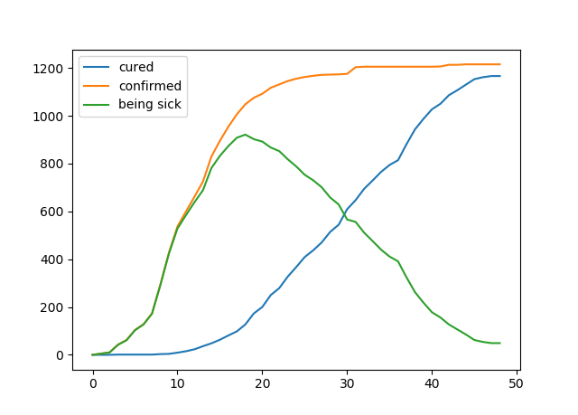

# Coronavirus-modelling

### update data to date
```
python data/dataUpdate.py
```

### get data from a province(by name) or a country(by code)

```python
import numpy as np
from matplotlib import pyplot as plt
from data.fetchdata import getProvinceData, getCountryData

date, confirmed, recovered = getProvinceData("浙江省")
# or
# date, confirmed, recovered = getCountryData("JP")

plt.plot(recovered, label='cured')
plt.plot(confirmed, label='confirmed')
plt.plot(confirmed-recovered, label='being sick')
plt.legend(loc='upper left')
plt.show()
```

