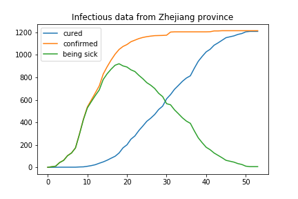
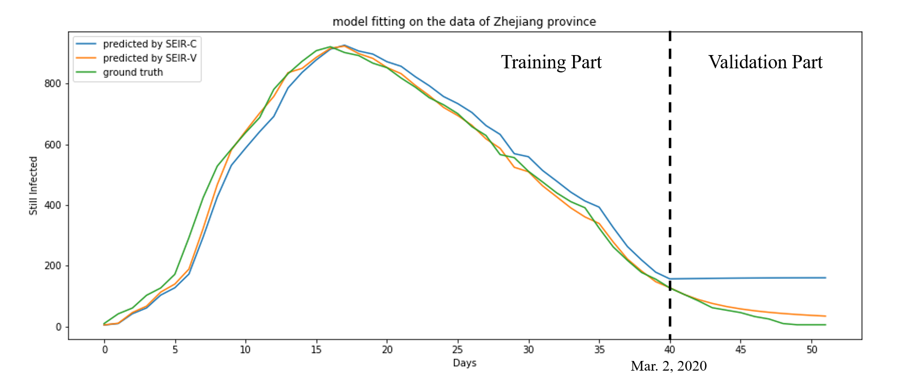

# Coronavirus-modelling

### update data to date
```
python data/dataUpdate.py
```

### get data from a province(by name) or a country(by code)
The data source is https://github.com/canghailan/Wuhan-2019-nCoV/, thanks for the contribution.

```python
from data.fetchdata import getProvinceData, getCountryData

date, confirmed, recovered = getProvinceData("浙江省")
# or
# date, confirmed, recovered = getCountryData("JP")

plt.plot(recovered, label='cured')
plt.plot(confirmed, label='confirmed')
plt.plot(confirmed-recovered, label='being sick')
plt.legend(loc='upper left')
plt.show()
```



In this project, we mainly use the data from Feb. 2, 2020 to Mar. 30, 2020 of Zhejiang province, China.

## SEIR-C model
#### Assumptions
- Considering the mortality of 2019-nCoV is approximately 2.84\% by now, we can assume the total population size is constant.
- The patients in exposed state are not yet infectious. From our current knowledge, we know this is untrue about 2019-nCov, but we'll still make this assumption to fit SEIR-C model.
- The number of people in incubation period is 4 times of the population of infectious people.

#### Model description
After applying the assumptions stated above on the epidemiological data from publicly available data sources, we are able to get the number of susceptible(S), exposed(E), infectious(I) and recovered(R) people in each day. The input of our model are S, E, I, R on the current day and the expected output are those on the next day. 
Besides the assumptions, we also made some constraints on the parameters, which come from the prior knowledge of epidemiology. To deal with these inequality constraints, we introduced the penalty terms on parameters, and then minimized the MSE between the predicted value and the ground truth by gradient descent method.

## SEIR-V model
Considering the government intervention, we know that the contact rate and recovery rate should not remain unchanged. As the COVID-19 spreads, the government will start to take more serious and strict controls which help increase people's awareness of prevention. With more and more schools and public facilities closed and most people staying home to avoid person-to-person contact, the contact rate beta will definitely drop through time. In addition, the recovery rate gamma will also start to rise since all the medical professions have more experience to deal with the virus. In our proposed SEIR-V model, we characterized the change of beta and gamma by two piecewise linear functions of time as shown below, where beta_i and gamma_i are learned parameters.


## Result Comparison
We took the data of first 40 days in Zhejiang province for training, and then used the trained parameters to predict the population of the infectious from March 1st by iteratively applying the model to the data predicted from the previous day. The forecast curves are shown in the figure below.



By taking these more reasonable and realistic assumptions into consideration, obviously, thr proposed SEIR-V model achieved a much better performance than SEIR-C, especially on the unseen data. We evaluated two models by mean absolute error, the SEIR-V model decreases the MAE by 84.4% from the SEIR-C model. (See the table below)


